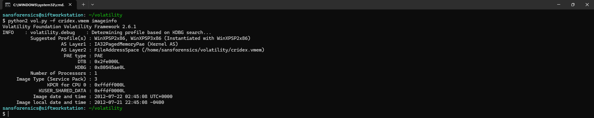
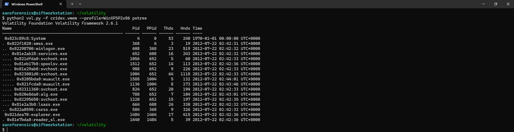
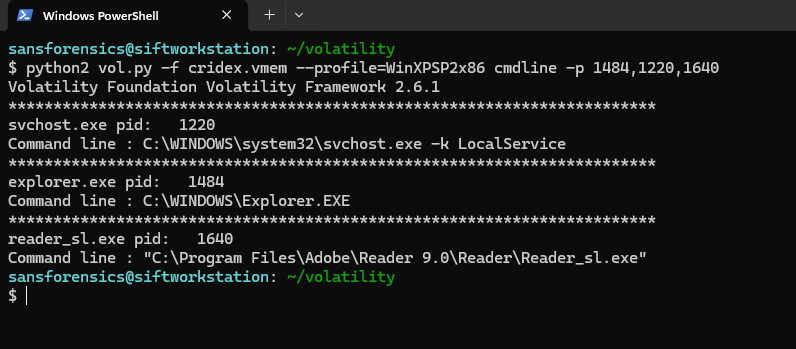
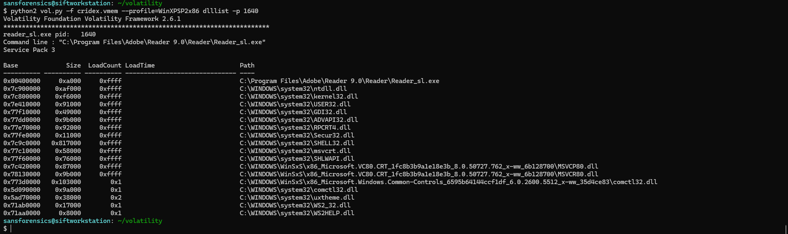

# CRIDEX Memory Forensics Case Study

This repository documents a step-by-step memory forensic investigation of the **CRIDEX banking trojan** using Volatility.

The objective of this case study was to identify malicious processes, validate malware artifacts, analyze persistence, and inspect suspicious network activity.

---

## Investigation Workflow

### 1. Memory Image Profiling

The memory image profile was identified to determine the correct operating system and volatility profile.



---

### 2. Suspicious Process Identification

The next step involved analyzing the active process hierarchy using Volatility's `pstree` plugin.

A suspicious process `reader_sl.exe` (PID: **1640**) was identified as a child of `explorer.exe`, which immediately stood out as potentially malicious.



Further command-line inspection was performed to validate the executable path and process context.



DLL inspection was then conducted on the suspicious process to review loaded modules and identify unusual libraries or injected components.



---

### 3. Malware Extraction and Validation

After identifying the suspicious process `reader_sl.exe` (PID: **1640**), the executable was extracted directly from memory using Volatility’s `procdump` plugin.

This allowed further static validation of the in-memory malicious PE.


The SHA256 hash of the dumped executable was then calculated to ensure file integrity and to correlate the sample with known malware signatures.


The calculated hash was validated using VirusTotal.

The result showed **28/71 detections**, confirming the sample as malicious and aligning with CRIDEX banking trojan indicators.


---

## 4. Behavioral String Analysis

To understand the malware’s behavior and intent, string analysis was performed on both the memory image and the dumped executable.

The first set of strings revealed multiple registry-related API calls such as `RegOpenKeyA`, `RegQueryValueExA`, and `RegCloseKey`, indicating interaction with Windows Registry keys and suggesting possible persistence mechanisms.


Further string analysis revealed the suspicious filename `KB00207877.exe`, which was later correlated with the persistence artifact found in the registry.


Network-related string artifacts exposed suspicious external IP addresses and URLs communicating over port **8080**, strongly indicating command-and-control (C2) communication.


Finally, multiple banking-related strings and financial institution references were identified, which strongly supports the classification of the sample as a **banking trojan** focused on credential theft.


---

## 5. Registry Persistence Analysis

Following the behavioral string analysis, registry artifacts were examined to validate the malware’s persistence mechanism.

The extracted hive was then parsed using Volatility’s `printkey` plugin to inspect the **Run** key.

This confirmed the presence of an autorun registry entry referencing the suspicious executable `KB00207877.exe`.


The user registry hive (`NTUSER.DAT`) was first extracted from the memory image using Volatility’s `dumpregistry` plugin for offline analysis.


To further validate the artifact, the dumped hive was opened in Registry Explorer.

The same Run key entry was observed pointing to:

```
C:\Documents and Settings\Robert\Application Data\KB00207877.exe
```

This confirms the malware establishes persistence at user logon.


---

### 6. Network Communication Analysis

To investigate potential command-and-control (C2) communication, network artifacts were analyzed using Volatility’s `connscan` and `sockets` plugins.

The `connscan` output revealed multiple suspicious outbound connections to external IP addresses over port **8080**, which is commonly used by malware for C2 traffic.


The identified external connections included:

```
41.168.5.140:8080
125.19.103.198:8080
```

Additional socket analysis further confirmed active network communication from the infected system.


These findings strongly indicate that the CRIDEX malware was attempting to communicate with external infrastructure, likely for data exfiltration, tasking, or credential theft operations.

---

## 7. Final Verdict

The memory forensic investigation confirms the presence of **CRIDEX banking malware** within the acquired memory image.

Key evidence includes:

- suspicious process execution via `reader_sl.exe`
    
- extracted malicious PE validation
    
- registry persistence using Run key
    
- outbound network communication over port 8080
    
- banking-related string artifacts
    
- multiple external IP indicators
    

Based on the combined process, persistence, and network findings, the sample is classified as a **banking trojan with credential theft and command-and-control capabilities**.