# Stuxnet Memory Forensics Analysis

> 	A DFIR-style memory forensics case study focused on investigating a Stuxnet-infected Windows memory image using industry-standard forensic techniques and Volatility-based analysis.

---

## Overview

This repository documents the forensic investigation of a **Stuxnet-infected Windows XP SP3 memory image** using **Volatility 2.6.1**.

The purpose of this project is to demonstrate a real-world **memory forensics workflow** used in malware triage and incident response.

### Objective

The objective of this case study was to:

- Identify malicious processes
- Validate malware artifacts
- Analyze persistence mechanisms
- Inspect suspicious network activity

The investigation focuses on:

- Memory image profiling
- Process tree reconstruction
- Suspicious `lsass.exe` validation
- DLL and command-line verification
- Memory injection detection
- Malicious process dumping
- Hash-based malware validation
- IOC extraction

---

## Lab Details

| Field          | Value                                   |
| -------------- | --------------------------------------- |
| Malware Sample | Stuxnet                                 |
| OS Profile     | WinXPSP2x86 / XP SP3                    |
| Tool Used      | Volatility 2.6.1                        |
| Analysis Type  | Memory Forensics                        |
| Objective      | Malware Detection & Artifact Extraction |

---

### 1. Memory Profile Identification

The first step was identifying the correct memory profile.

**Finding:**

- Suggested profile: **`WinXPSP2x86`**
- Service Pack: **`SP3`**
- System time successfully recovered

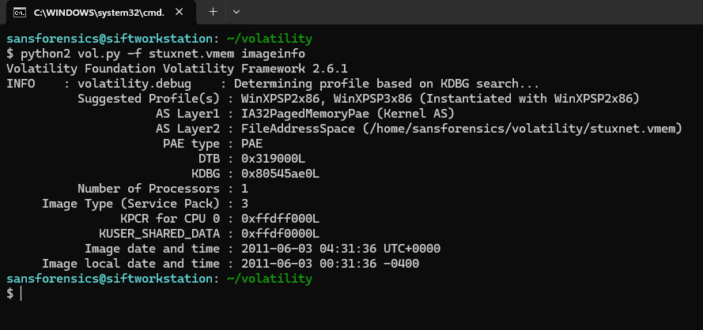

---

### 2. Process Tree Analysis

During process enumeration, multiple suspicious `lsass.exe` instances were identified.

This immediately raised suspicion because legitimate Windows XP systems should typically have only one valid LSASS process.

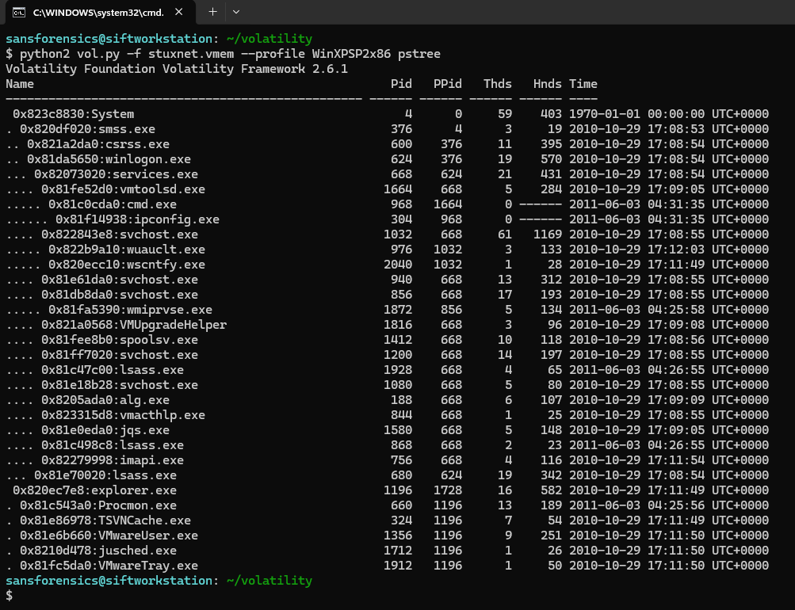

---

### 3. Command Line Validation

**python2 vol.py -f stuxnet.vmem --profile WinXPSP2x86 cmdline -p 680,868,1928**

The command lines pointed to legitimate paths:

**C:\WINDOWS\system32\lsass.exe**

This indicates **process masquerading / process injection**, where malware hides behind legitimate process names.

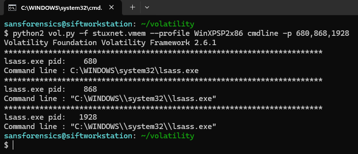

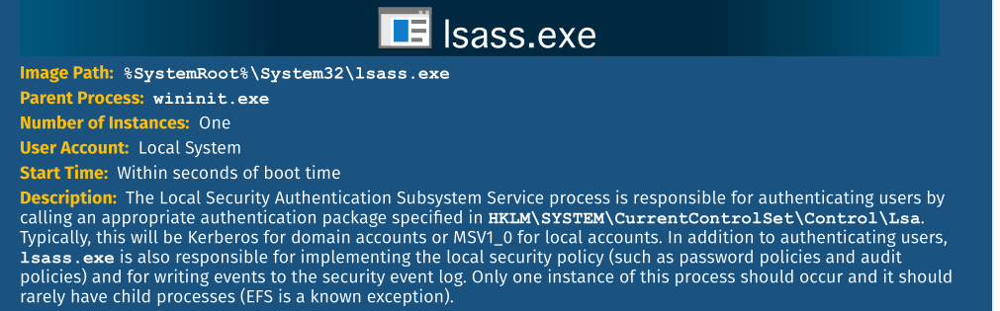

---

### 4. Network Socket Analysis

**python2 vol.py -f stuxnet.vmem --profile WinXPSP2x86 sockets**

During socket analysis, UDP ports **500** and **4500** were identified.

These ports are commonly used for **IPsec / IKE communication** and are generally considered legitimate system or VPN-related traffic.

- UDP 500 → Internet Key Exchange (IKE)
- UDP 4500 → NAT Traversal (NAT-T)

After correlation with process context and system behavior, these connections were assessed as **legitimate network activity rather than malicious communication**.

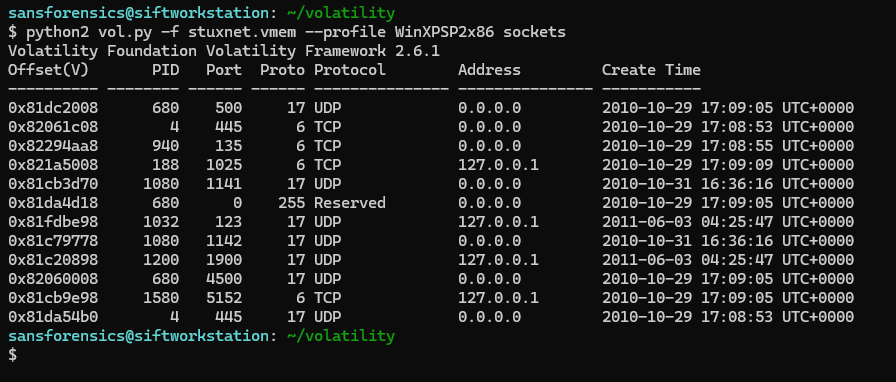

---

### 5. DLL Validation

The LSASS instances were compared by DLL count and critical authentication DLL presence.

Examples checked:

- **`netlogon.dll`**
- **`kerberos.dll`**

This helped differentiate legitimate vs injected processes.

The Legitimate lsass.exe loads more DLL Files than Malicious lsass.exe

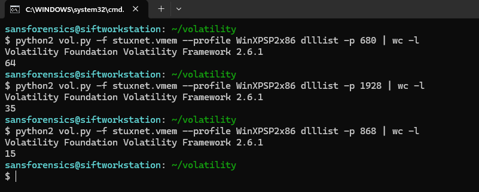

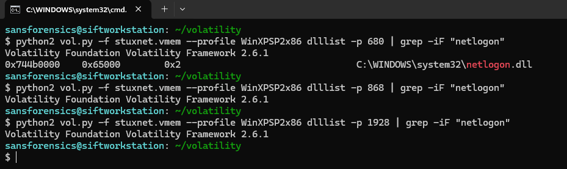

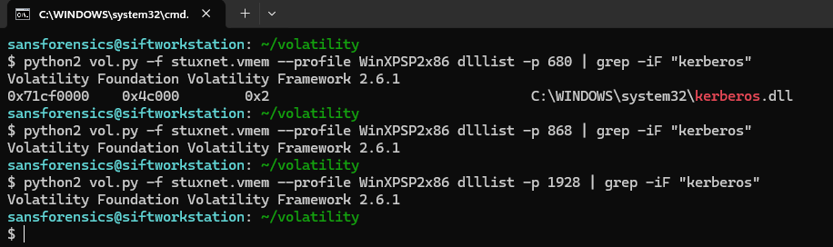

---

### 6. Memory Injection Detection

**python2 vol.py -f stuxnet.vmem --profile WinXPSP2x86 malfind -p 868,1928**

**`malfind`** revealed suspicious **RWX memory regions**.

Key indicator:

**PAGE_EXECUTE_READWRITE**

MZ header present

This is a strong sign of:

- code injection
- unpacked payload
- in-memory PE loader

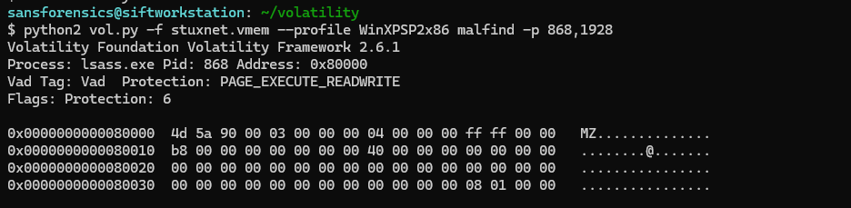

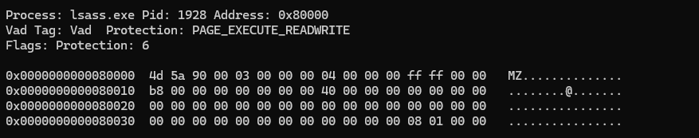

---

### 7. Process Dumping

**python2 vol.py -f stuxnet.vmem --profile WinXPSP2x86 procdump -p 1928,868,940,668,600,1196 -D Malicious-Objects/**

Suspicious processes were dumped for offline malware verification.

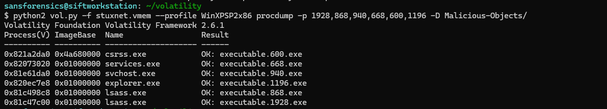

---

### 8. Hash Validation / VirusTotal

The dumped binaries were hashed and checked.

Result:

- Multiple engines flagged the files
- Family labels included:
    - `stuxnet`
    - `duqu`
    - `ulise`

This strongly confirms malicious activity.

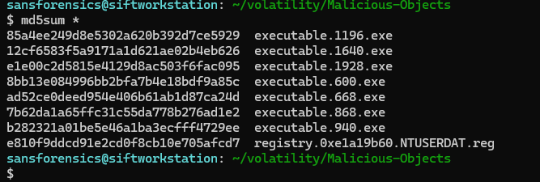

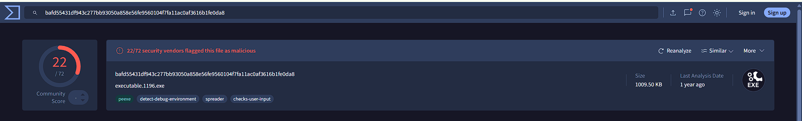

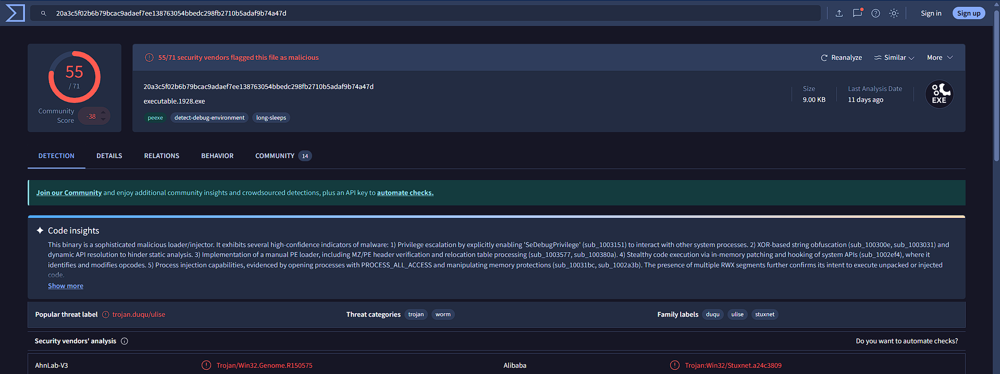

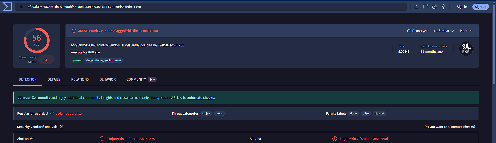

---

## Indicators of Compromise (IOCs)

| Type               | Value                  |
| ------------------ | ---------------------- |
| Suspicious Process | lsass.exe              |
| PIDs               | 868, 1928,1196         |
| Memory Protection  | PAGE_EXECUTE_READWRITE |
| Malware Family     | Stuxnet / Duqu         |

---

## Key Takeaways

This case study demonstrates how malware can:

- inject into trusted system processes
- hide behind legitimate names
- maintain in-memory execution
- evade basic static detection

---

## Author

### Anshraj Dodiya
