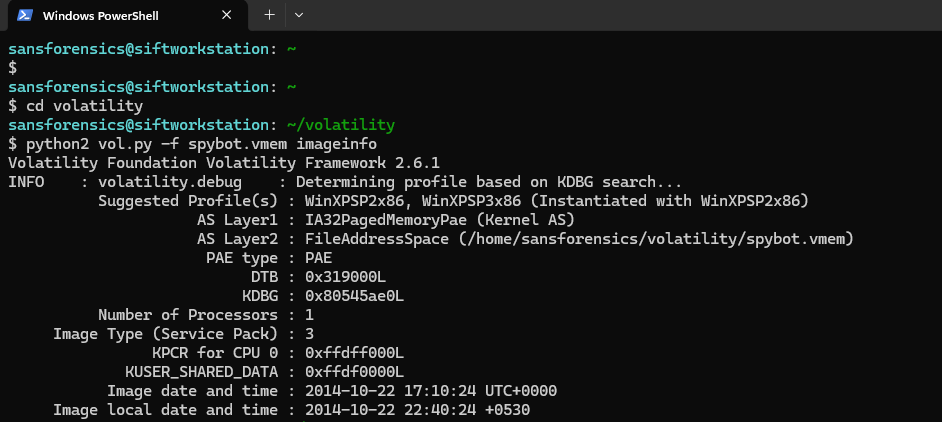
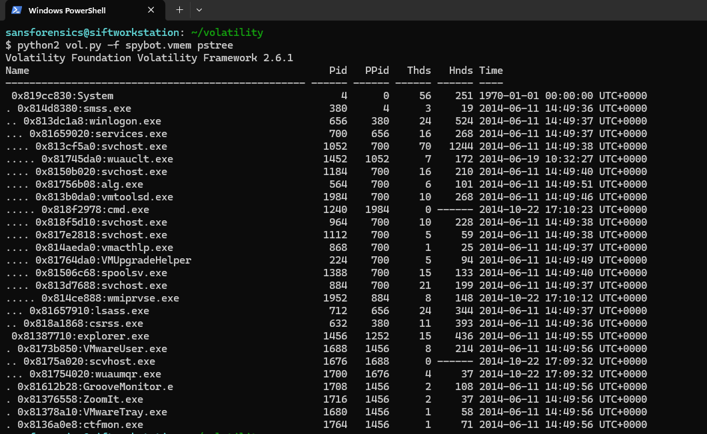
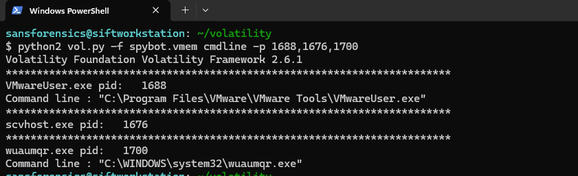
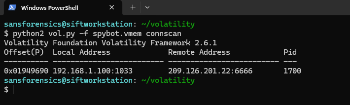
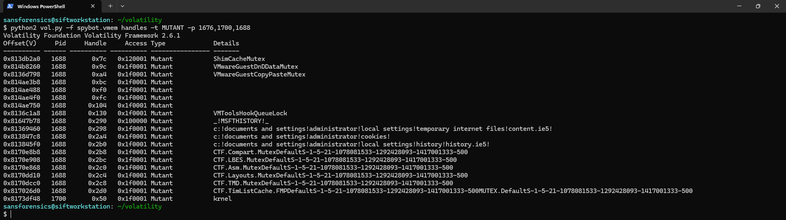
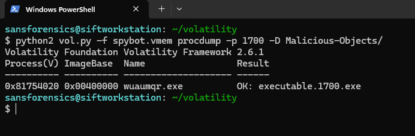
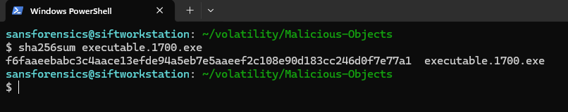
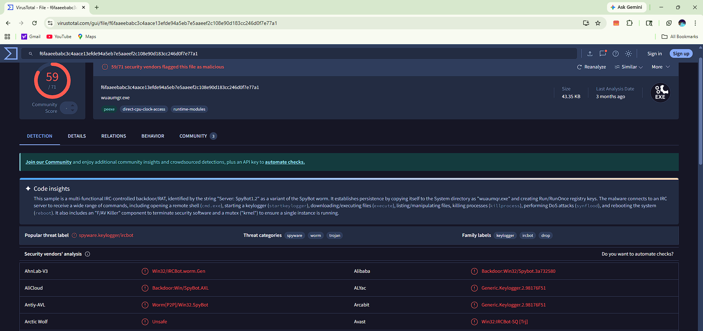

# Spybot Memory Forensics Analysis

> A DFIR-style memory forensics case study focused on investigating a Spybot-infected Windows memory image using industry-standard forensic techniques and Volatility-based analysis.

## Objective

- Identify suspicious and malicious processes from the memory image
- Analyze parent-child process relationships
- Inspect active network connections for potential C2 communication
- Identify mutexes and other runtime indicators
- Extract malicious executables from memory
- Validate malware artifacts using hash-based threat intelligence
- Classify the malware based on forensic evidence and behavioral findings
---

## Lab Details  
  
| Field          | Value                           |
| -------------- | ------------------------------- |
| Malware Sample | Spybot                          |
| OS Profile     | WinXPSP3x86                     |
| Tool Used      | Volatility 2.6.1                |
| Analysis Type  | Memory Forensics                |
| Objective      | Malware Detection & C2 Analysis |

---

### 1. Memory Profile Identification  
  
The first step was identifying the correct memory profile.  
  
**Finding:**  
  
- Suggested profile: **`WinXPSP3x86`**  
- Service Pack: **`SP3`**
- Operating System: **Windows XP SP3**  
- System time successfully recovered  

  
---

### 2. Suspicious Process Identification  
  
The next step involved analyzing the active process hierarchy using Volatility’s `pstree` plugin.  
  
**Finding:**  
  
- Suspicious process identified: **`scvhost.exe`**  
- Process state: **Exited**  
- Parent process: **`VMwareUser.exe`**  
- Child process spawned: **`wuaumqr.exe`**  
- The process name closely mimics the legitimate Windows process **`svchost.exe`**  
- This indicates **process masquerading / defense evasion behavior**  
- The spawned child process **`wuaumqr.exe`** was identified as the **actual malicious payload**

---

### 3. Command Line Analysis  
  
The command-line arguments were inspected using Volatility’s `cmdline` plugin to validate the execution path of the active malicious process.  
  
**Finding:**  
  
- Active process identified: **`wuaumqr.exe`**  
- Executable path recovered successfully:  
  **`C:\WINDOWS\system32\wuaumqr.exe`**  
- Confirms the malicious payload was executed from the **system32 directory**  
- The parent process `scvhost.exe` was already in an **exited state**

---

### 4. Network Communication Analysis  
  
The next step involved analyzing active network artifacts using Volatility’s `connscan` plugin.  
  
**Finding:**  
  
- Suspicious external connection identified  
- Local address: **`192.168.1.100:1033`**  
- Remote address: **`209.126.201.22:6667`**  
- The connection is associated with **`wuaumqr.exe`**  
- Port **`6667`** indicates possible **IRC-based command-and-control (C2) communication**

---

### 5. Mutex Analysis

The next step involved analyzing mutex handles using Volatility’s `handles` plugin.

**Finding:**

- Suspicious mutex identified: **`krnel`**
- Associated process: **`wuaumqr.exe`**
- Confirms runtime artifact linked to the malicious payload
- Indicates the malware may be using a mutex to ensure single-instance execution

---

### 6. Malware Extraction and Validation

The malicious process was extracted from memory using Volatility’s `procdump` plugin for further validation.

**Finding:**

- Malicious process dumped successfully: **`wuaumqr.exe`**
- Dumped process PID: **`1700`**
- SHA256 hash calculated successfully
- Hash value:
  **`f6faaeebab3c4aace13efde94a5eb7e5aaeef2c108e90d183cc246d0f7e77a1`**
- VirusTotal detection confirmed the sample as **Spybot malware**

---

## Author

### Anshraj Dodiya
