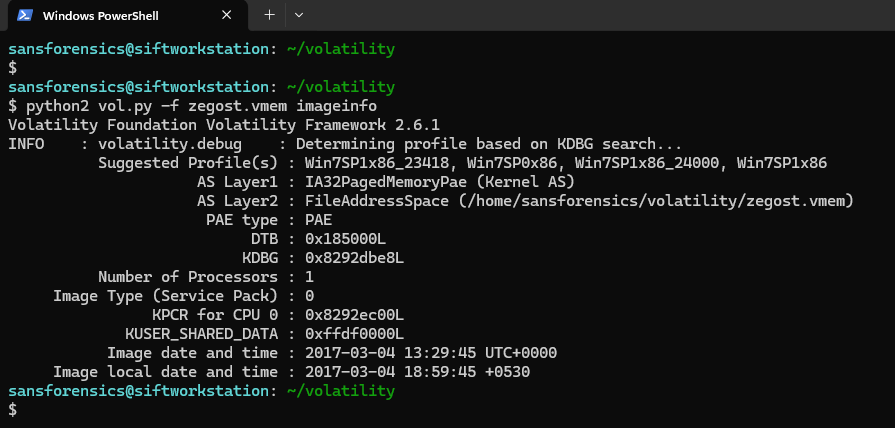
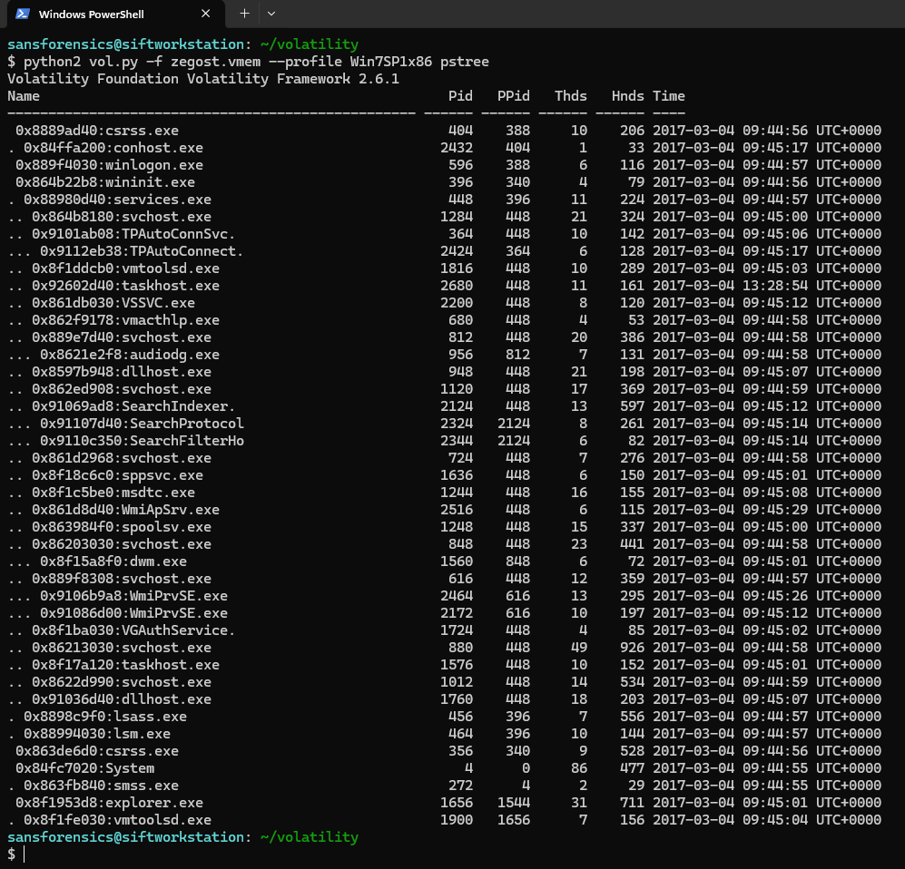
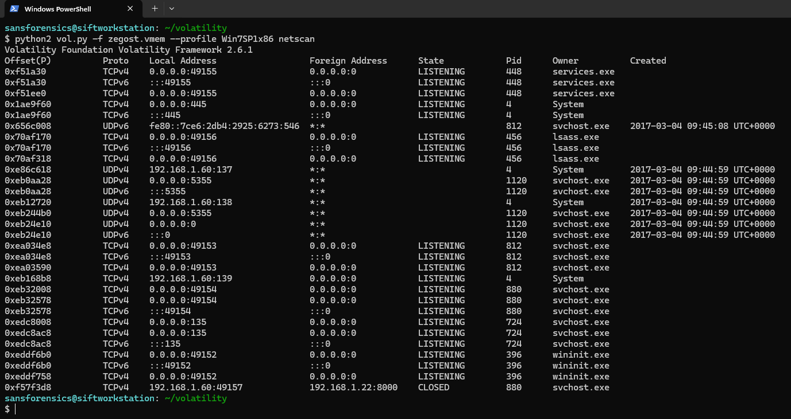
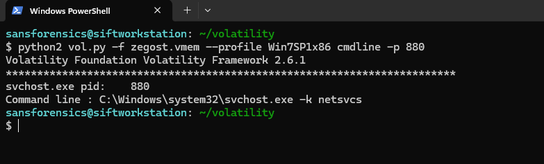
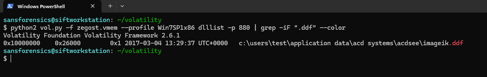
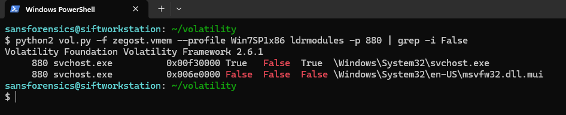
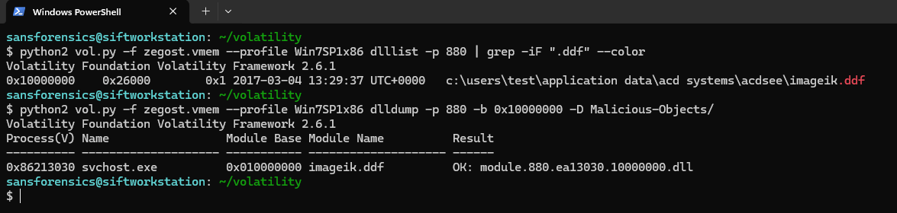
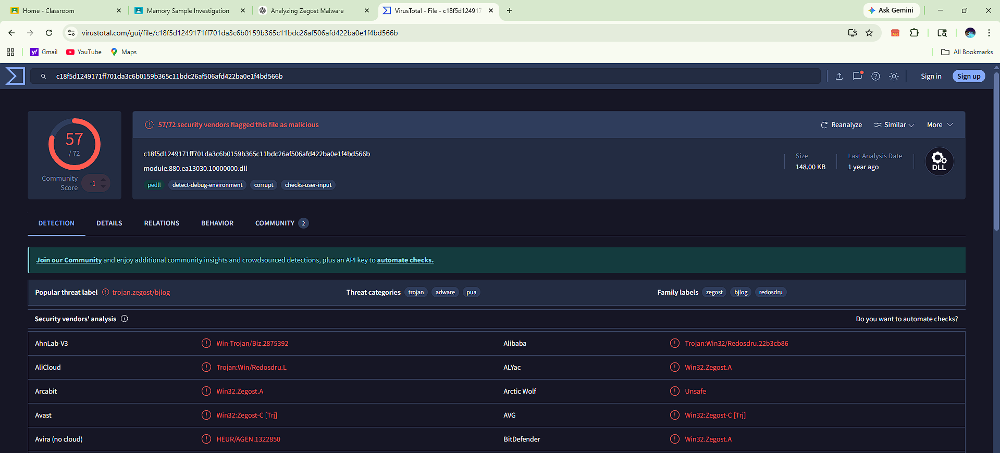

# Zegost Memory Analysis

This repository documents a step-by-step memory forensic investigation of the **Zegost malware** using Volatility.

The objective of this case study was to identify malicious processes, detect injected modules, validate malware artifacts, and confirm the malware family using threat intelligence.

---

## Lab Details

| Field | Value |
|---|---|
| Malware Sample | Zegost |
| OS Profile | Win7SP1x86 |
| Tool Used | Volatility 2.6.1 |
| Analysis Type | Memory Forensics |
| Objective | DLL Injection Detection & Malware Validation |

---

## Investigation Workflow

### 1. Memory Profile Identification

The first step was identifying the correct memory profile.

**Finding:**

- Suggested profile: **`Win7SP1x86`**
- System time successfully recovered
- Image date: **`2017-03-04 13:29:45 UTC`**

---

### 2. Suspicious Process Identification

The next step involved analyzing the active process hierarchy using Volatility’s `pstree` plugin.

**Finding:**

- Suspicious process identified: **`svchost.exe`**
- PID: **`880`**
- Non-standard network activity observed later
- Selected for deeper DLL inspection

---

### 3. Network Communication Analysis

Network artifacts were inspected using Volatility’s `netscan` plugin.

**Finding:**

- Suspicious outbound connection identified
- Local address: **`192.168.1.60:49157`**
- Remote address: **`192.168.1.22:8000`**
- Connection state: **`CLOSED`**
- Associated process: **`svchost.exe` (PID 880)**

---

### 4. Command Line Validation

The command-line arguments of the suspicious process were inspected.

**Finding:**

- Process: **`svchost.exe`**
- PID: **`880`**
- Command line:
  **`C:\Windows\system32\svchost.exe -k netsvcs`**

---

### 5. Suspicious DLL Detection

DLL analysis was performed using `dlllist`.

**Finding:**

- Suspicious DLL identified:
  **`imageik.ddf`**
- Loaded from:
  **`C:\Users\test\Application Data\ACD Systems\ACDSee\imageik.ddf`**
- Strong indicator of injected malicious module

---

### 6. Unlinked Module Detection

Further validation was performed using `ldrmodules`.

**Finding:**

- Suspicious unlinked module detected
- Multiple flags marked **False**
- Indicates **hidden / manually mapped DLL injection**

---

### 7. DLL Extraction and Validation

The suspicious DLL was extracted from memory using `dlldump`.

**Finding:**

- Extracted module:
  **`module.880.ea13030.10000000.dll`**
- PE header validated successfully
- SHA256 hash generated

---
### 8. Static DLL Analysis

After extracting the suspicious DLL from memory, manual static analysis was performed to validate its behavior and authenticity.

**Finding:**

- The DLL was observed utilizing **`netsvcs`**
- Multiple suspicious **malicious functions / API references** were identified
- Embedded **domain names / network artifacts** were recovered
- These findings strongly support **network-enabled trojan behavior**
- Confirms the DLL as the malicious component injected into `svchost.exe`
___

### 9. Threat Intelligence Validation

The extracted DLL hash was validated using VirusTotal.

**Finding:**

- Detection ratio: **`57/72`**
- Malware family: **`Zegost`**
- Classified as **Trojan**

---

## Final Verdict

The memory forensic investigation confirms the presence of **Zegost malware** through DLL injection and hidden module artifacts.

---

## Author

### Anshraj Dodiya