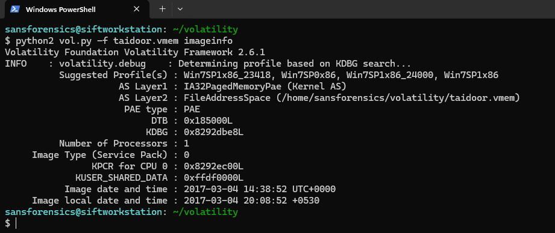
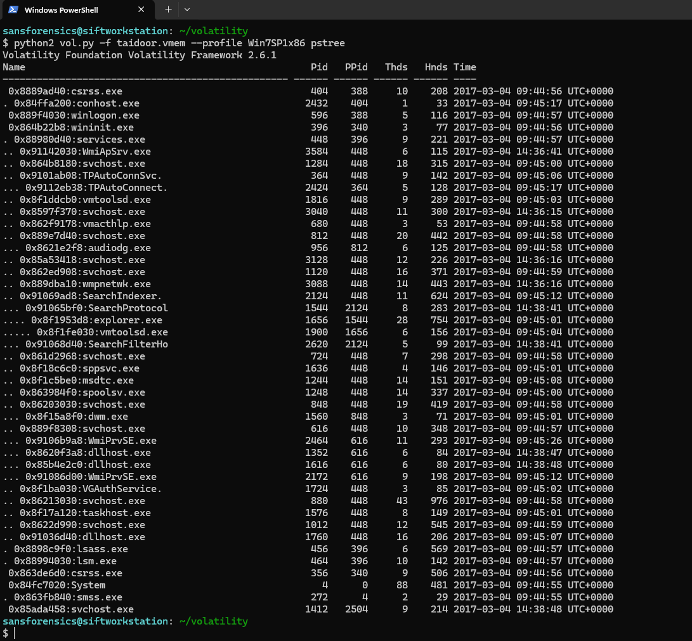
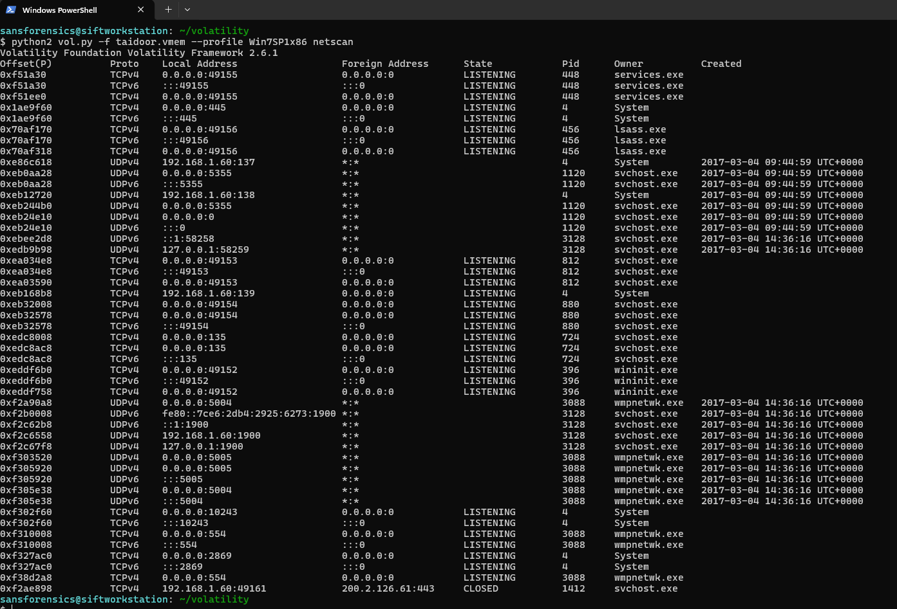
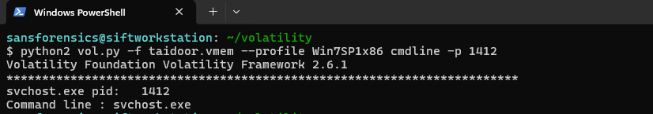
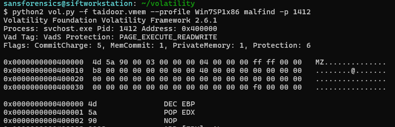
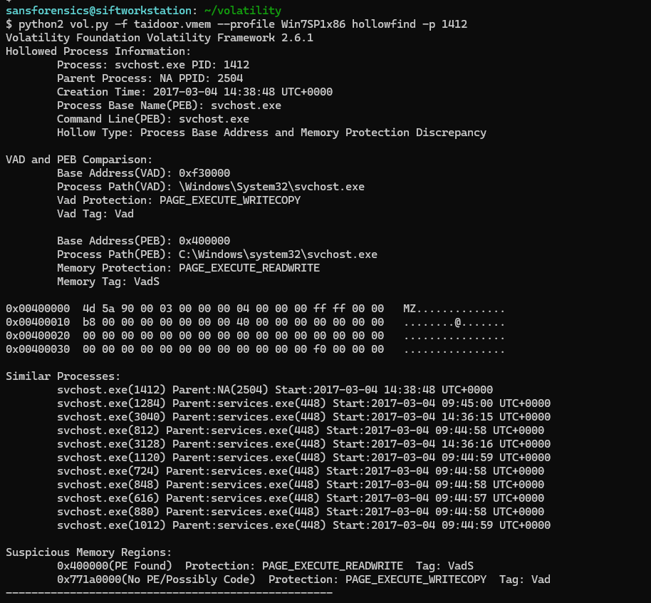
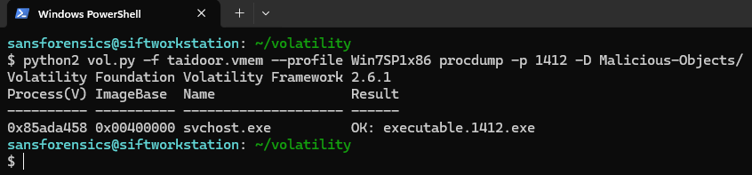
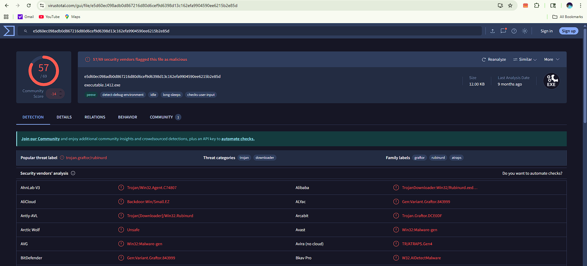

# Taidoor Memory Analysis

This repository documents a step-by-step memory forensic investigation of the **Taidoor malware** using Volatility.

The objective of this case study was to identify suspicious processes, detect injected memory regions, validate process hollowing, analyze C2 communication, and confirm the malware using threat intelligence.

---

## Lab Details

| Field | Value |
|---|---|
| Malware Sample | Taidoor |
| OS Profile | Win7SP1x86 |
| Tool Used | Volatility 2.6.1 |
| Analysis Type | Memory Forensics |
| Objective | Process Hollowing & Payload Validation |

---

## Investigation Workflow

### 1. Memory Profile Identification

The first step was identifying the correct memory profile.

**Finding:**

- Suggested profile: **`Win7SP1x86`**
- System time successfully recovered
- Image date: **`2017-03-04 14:38:52 UTC`**

---

### 2. Suspicious Process Identification

The next step involved analyzing the active process hierarchy using Volatility’s `pstree` plugin.

**Finding:**

- Suspicious process identified: **`svchost.exe`**
- PID: **`1412`**
- Parent PID: **`2504`**
- Selected for deeper memory analysis due to suspicious network activity

---

### 3. Network Communication Analysis

The next step involved analyzing active network artifacts using Volatility’s `netscan` plugin.

**Finding:**

- Suspicious outbound connection identified
- Local address: **`192.168.1.60:49161`**
- Remote address: **`200.2.126.61:443`**
- Connection state: **`CLOSED`**
- Associated process: **`svchost.exe` (PID 1412)**

---

### 4. Command Line Validation

The command-line arguments of the suspicious process were inspected.

**Finding:**

- Process: **`svchost.exe`**
- PID: **`1412`**
- Command line recovered successfully

---

### 5. Injected Memory Detection

Memory regions were analyzed using Volatility’s `malfind` plugin.

**Finding:**

- Injected memory region detected at **`0x400000`**
- Valid **MZ header** identified
- Indicates suspicious executable code injection

---

### 6. Process Hollowing Detection

Further validation was performed using `hollowfind`.

**Finding:**

- **Process hollowing confirmed**
- Hollow type:
  **Process Base Address and Memory Protection Discrepancy**
- Suspicious executable region identified
- Confirms in-memory payload replacement

---

### 7. Malware Extraction and Validation

The suspicious process was dumped from memory using `procdump`.

**Finding:**

- Extracted file:
  **`executable.1412.exe`**
- SHA256 generated successfully
- VirusTotal validation confirmed malicious payload

---

### 8. Threat Intelligence Validation

The extracted payload was validated using VirusTotal.

**Finding:**

- Detection ratio: **`57/69`**
- Malware classified as **Trojan / Downloader**
- Strong Taidoor / backdoor indicators

---

## Final Verdict

The memory forensic investigation confirms the presence of **Taidoor malware** through process hollowing, injected memory regions, suspicious network communication, and malicious payload validation.

---

## Author

### Anshraj Dodiya