# WannaCry Memory Analysis

This repository documents a step-by-step memory forensic investigation of the **WannaCry ransomware** using Volatility.

The objective of this case study was to identify the ransomware execution chain, detect persistence mechanisms, recover ransom note artifacts, extract onion/bitcoin IOCs, validate Tor communication, and confirm the malware through threat intelligence.

---

## Lab Details

| Field | Value |
|---|---|
| Malware Sample | WannaCry |
| OS Profile | Win7SP1x64 |
| Tool Used | Volatility 2.6.1 |
| Analysis Type | Memory Forensics |
| Objective | Ransomware Execution & IOC Validation |

---

## Investigation Workflow

### 1. Memory Profile Identification

The first step was identifying the correct memory profile.

**Finding:**

- Suggested profile: **`Win7SP1x64`**
- Image time successfully recovered
- Image date: **`2021-02-22 17:55:26 UTC`**

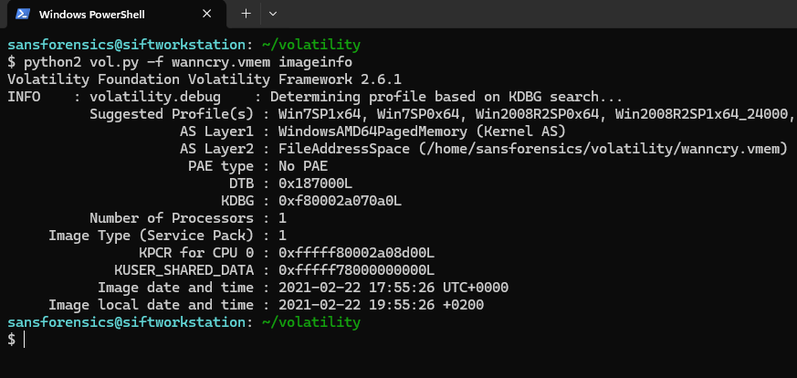

---

### 2. Ransomware Process Chain

The process hierarchy was analyzed using `pstree`.

**Finding:**

Suspicious ransomware chain identified:

```text
explorer.exe
 ├── WannaCry.EXE (PID 2464)
 │    ├── @WanaDecryptor (PID 2340)
 │    └── @WanaDecryptor (PID 2752)
 └── taskhsvc.exe (PID 2092)
```

This clearly indicates ransomware staging and decryption interface execution.

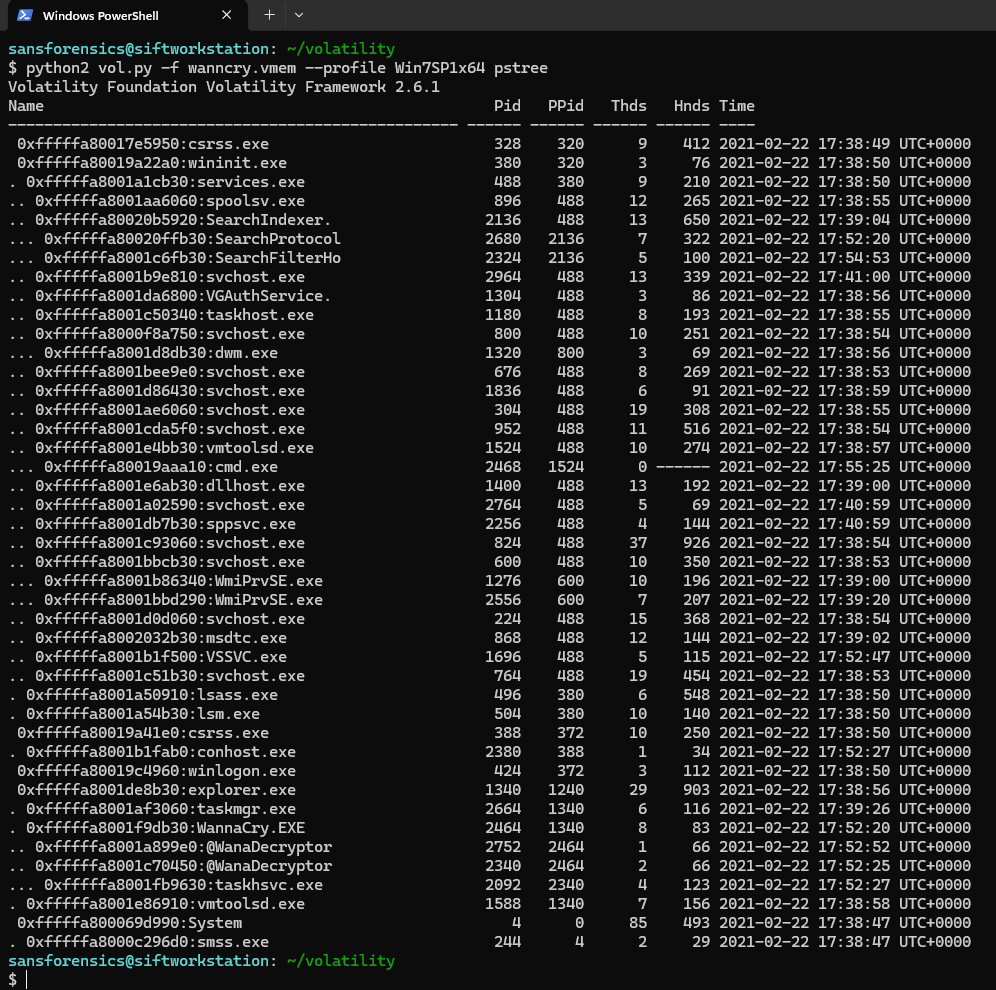

---

### 3. Command Line Validation

The suspicious processes were validated through `cmdline`.

**Finding:**

Recovered processes:

- **WannaCry.EXE**
- **@WanaDecryptor**
- **taskhsvc.exe**
- **taskmgr.exe**

The full ransomware execution chain was successfully validated.

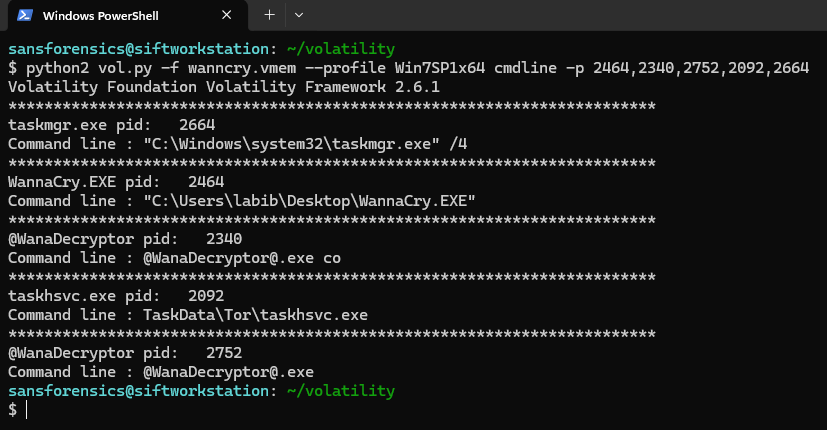

---

### 4. Network Activity & C2 Analysis

Network artifacts were analyzed using `netscan`.

**Finding:**

Multiple suspicious outbound connections were identified from **taskhsvc.exe**:

- **94.130.200.167:443**
- **51.81.93.162:443**
- **83.212.99.68:443**
- **204.11.50.131:9001**
- **82.149.227.236:9001**
- **131.188.40.189:443**

These indicate **Tor relay / C2 communication**.

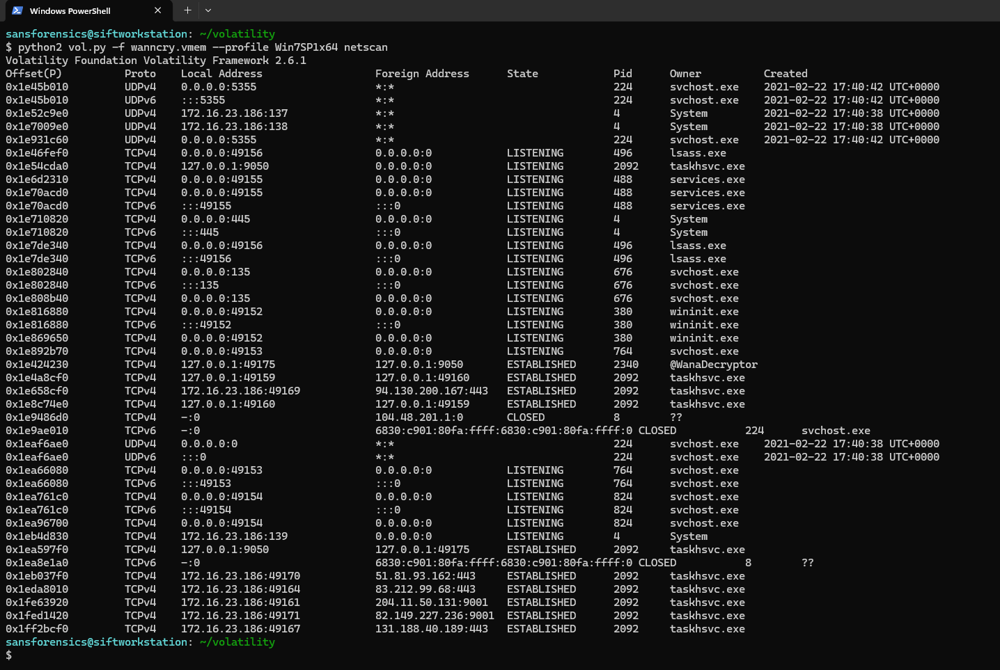

---

### 5. Tor Artifact Discovery

File handle analysis of `taskhsvc.exe` revealed Tor-related artifacts.

**Finding:**

Recovered artifact:

```text
\AppData\Roaming\tor\lock
```

This confirms Tor service execution.

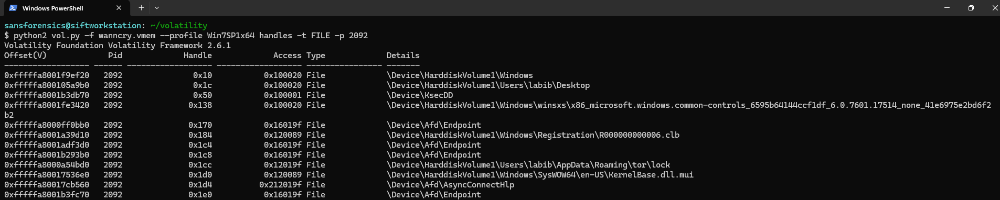

---

### 6. Encryption Artifact Discovery

Handles for the ransomware process showed encryption artifacts.

**Finding:**

Recovered encrypted extension:

```text
00000000.eky
hibsys.WNCRYT
```

These strongly confirm file encryption behavior.

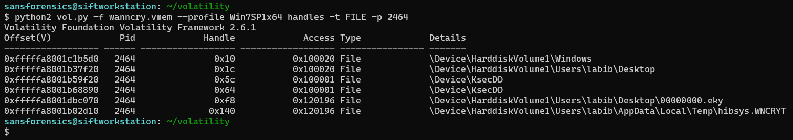

---

### 7. Loaded Module Analysis

DLL analysis confirmed malicious module loading.

**Finding:**

Key suspicious modules:

- `libevent-2-0-5.dll`
- `libssp-0.dll`
- `zlib1.dll`
- `SSLEAY32.dll`
- `LIBEAY32.dll`

These support Tor-based communication and ransomware execution.

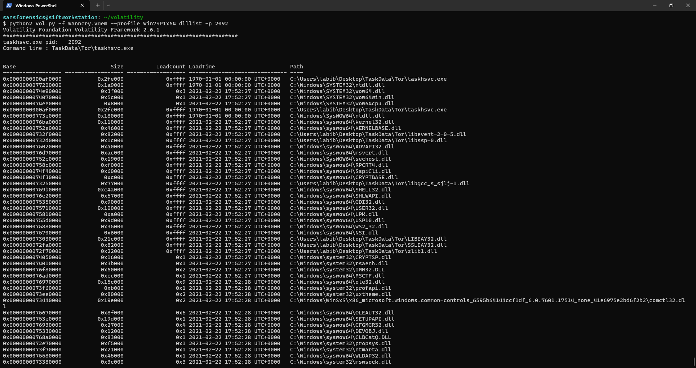

---

### 8. Mutex Artifacts

Mutexes were extracted from the ransomware process.

**Finding:**

Recovered mutexes:

```text
MsWinZonesCacheCounterMutexA
MsWinZonesCacheCounterMutexA0 (SUSPICIOUS)
```

These are known runtime synchronization artifacts.

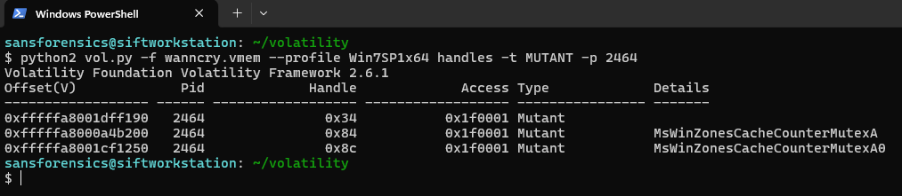

---

### 9. Hidden Module Anomalies

`ldrmodules` revealed hidden or unlinked modules.

**Finding:**

Multiple entries marked:

```text
False False False
```

This indicates hidden module anomalies and possible defense evasion.

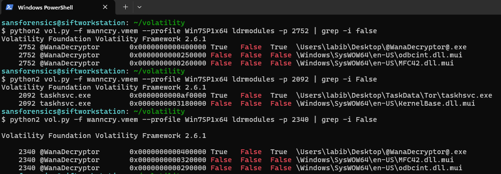

---

### 10. Persistence Mechanism

Registry persistence was analyzed using `printkey`.

**Finding:**

Recovered Run key:

```text
C:\Users\labib\Desktop\tasksche.exe
```

This confirms **startup persistence**.

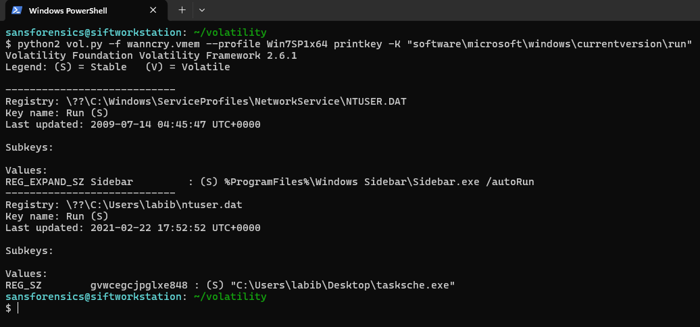

---

### 11. Malware Extraction

All suspicious processes were dumped successfully.

**Finding:**

Recovered:

- `WannaCry.EXE`
- `taskhsvc.exe`
- `@WanaDecryptor`
- second decryptor instance

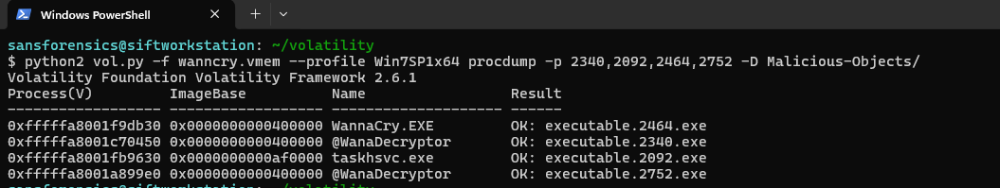

---

### 12. IOC Extraction

String analysis revealed strong ransomware IOCs.

**Finding:**

Recovered onion domains:

```text
57g7spgrzlojinas.onion
gx7ekbenv2riucmf.onion
```

Recovered ransom strings:

```text
Send $300 worth of bitcoin
```

This strongly confirms WannaCry behavior.

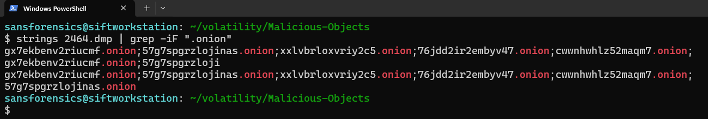

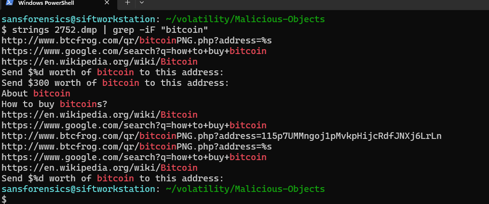

---

### 13. Threat Intelligence Validation

VirusTotal validation confirmed the sample.

**Finding:**

- Detection ratio: **67/71**
- Classified as:
  **WannaCry / WannaCryptor**
- Ransomware confirmed

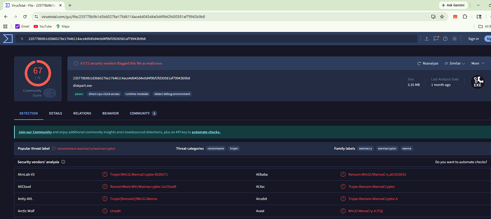

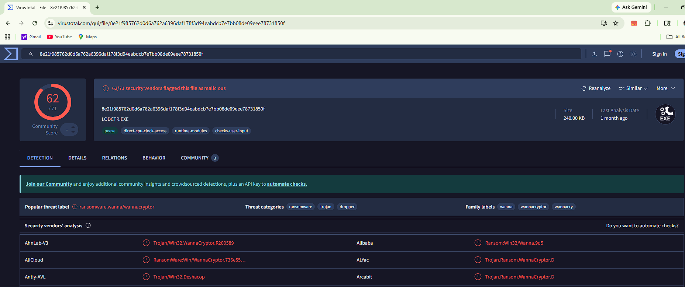

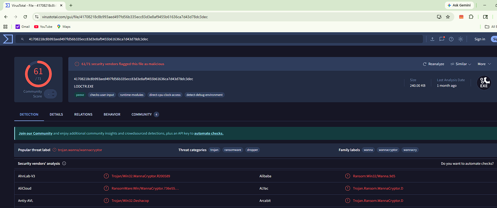

---

## Final Verdict

The memory investigation conclusively confirms **WannaCry ransomware infection** with:

- ransomware execution chain
- Tor communication
- onion IOCs
- bitcoin ransom note
- persistence
- encrypted file artifacts
- VT validation

---

## Author

### Anshraj Dodiya